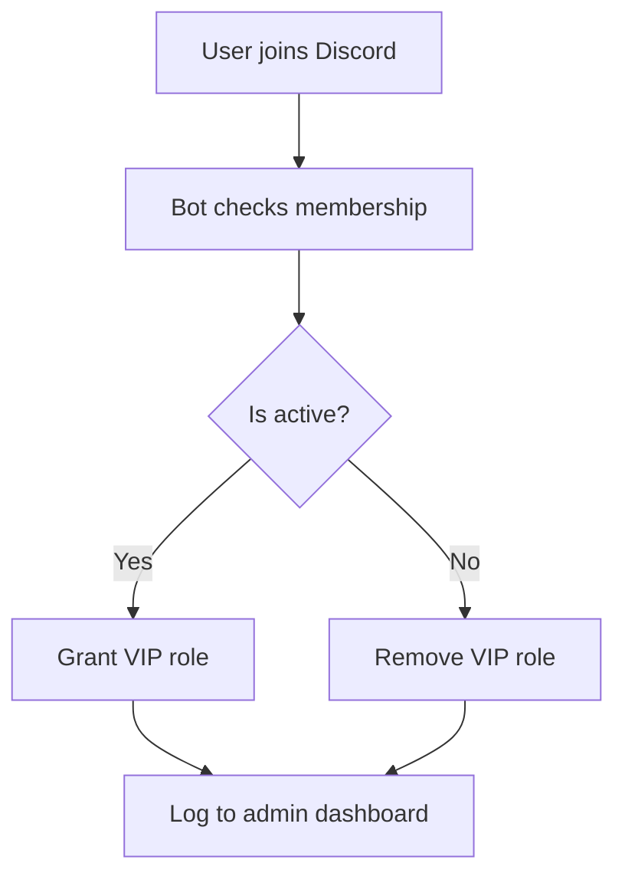

# Mermaid Diagram

```mermaid
flowchart TD
    A[User joins Discord] --> B[Bot checks membership]
    B --> C{Is active?}
    C -->|Yes| D[Grant VIP role]
    C -->|No| E[Remove VIP role]
    D --> F[Log to admin dashboard]
    E --> F
```
