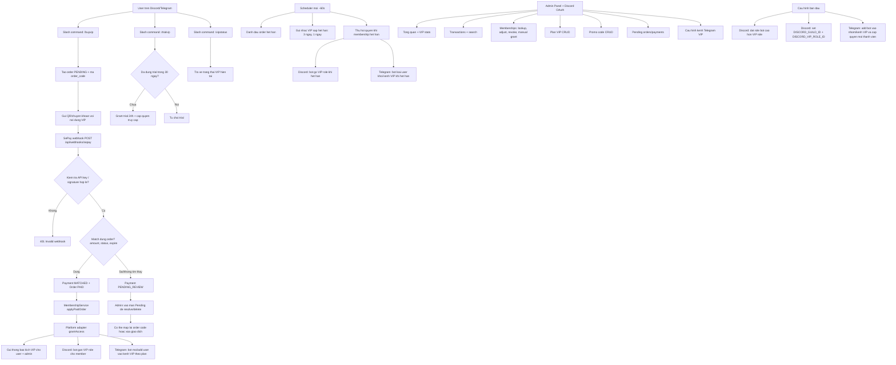

# Mermaid Diagram - Luong Chuc Nang Du An

```mermaid
flowchart TD
    U[User tren Discord/Telegram] --> C1[Slash command: /buyvip]
    U --> C2[Slash command: /trialvip]
    U --> C3[Slash command: /vipstatus]

    C1 --> O[Tao order PENDING + ma order_code]
    O --> Q[Gui QR/chuyen khoan voi noi dung VIP <order_code>]
    Q --> W[SePay webhook POST /api/webhooks/sepay]
    W --> V{Kiem tra API key / signature hop le?}
    V -->|Khong| R1[401 Invalid webhook]
    V -->|Co| M{Match dung order? amount, status, expire}

    M -->|Dung| P1[Payment MATCHED + Order PAID]
    P1 --> G1[MembershipService applyPaidOrder]
    G1 --> A1[Platform adapter grantAccess]
    A1 --> N1[Gui thong bao kich VIP cho user + admin]

    M -->|Sai/khong tim thay| P2[Payment PENDING_REVIEW]
    P2 --> A2[Admin vao man Pending de resolve/delete]
    A2 --> R2[Co the map lai order code hoac xoa giao dich]

    C2 --> T1{Da dung trial trong 30 ngay?}
    T1 -->|Chua| T2[Grant trial 24h + cap quyen truy cap]
    T1 -->|Roi| T3[Tu choi trial]

    C3 --> S1[Tra ve trang thai VIP hien tai]

    SCH[Scheduler moi ~60s] --> E1[Danh dau order het han]
    SCH --> E2[Gui nhac VIP sap het han: 3 ngay, 1 ngay]
    SCH --> E3[Thu hoi quyen khi membership het han]

    ADM[Admin Panel + Discord OAuth] --> D1[Tong quan + VIP stats]
    ADM --> D2[Transactions + search]
    ADM --> D3[Memberships: lookup, adjust, revoke, manual grant]
    ADM --> D4[Plan VIP CRUD]
    ADM --> D5[Promo code CRUD]
    ADM --> D6[Pending orders/payments]
    ADM --> D7[Cau hinh kenh Telegram VIP]

    CFG[Cau hinh ban dau] --> CF1[Discord: dat role bot cao hon VIP role]
    CFG --> CF2[Discord: set DISCORD_GUILD_ID + DISCORD_VIP_ROLE_ID]
    CFG --> CF3[Telegram: add bot vao nhom/kenh VIP va cap quyen moi thanh vien]

    A1 --> DIS1[Discord: bot gan VIP role cho member]
    E3 --> DIS2[Discord: bot go VIP role khi het han]
    A1 --> TG1[Telegram: bot moi/add user vao kenh VIP theo plan]
    E3 --> TG2[Telegram: bot loai user khoi kenh VIP khi het han]
```
