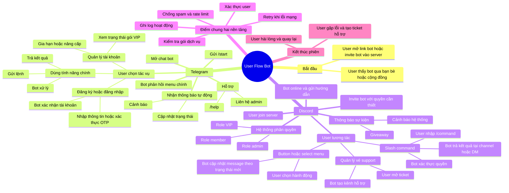

# Mindmap User Flow Bot (Telegram + Discord)

## Gợi ý xem trong VS Code

- Cài extension: `Markdown Preview Mermaid Support` hoặc dùng bản VS Code đã hỗ trợ Mermaid.
- Mở file và bấm `Ctrl+Shift+V` để xem preview.
